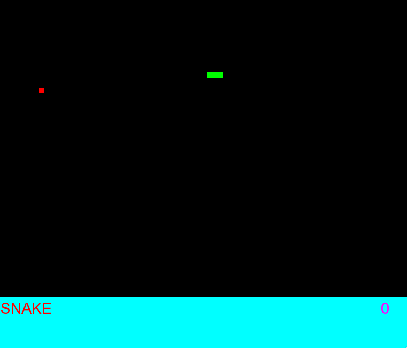
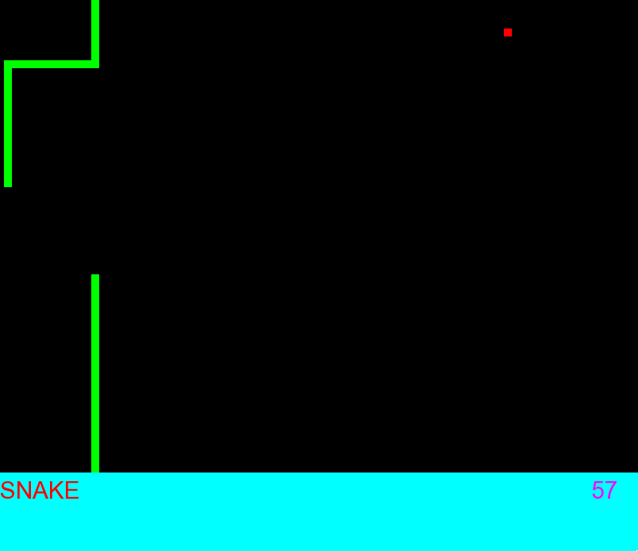

# Snake-CP-SemIII
Snake game made for semIII computer programming project

# Installation

* Install SFML library   Instruction and download is on this site:
   https://www.sfml-dev.org/download/sfml/2.5.1/

* Run `make` command in root folder

# Documentation

[Code documentation pdf](doc/latex/refman.pdf)

[Code documentation html](doc/html/index.html)

# Screenshots

